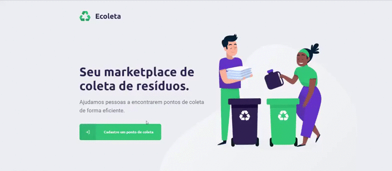
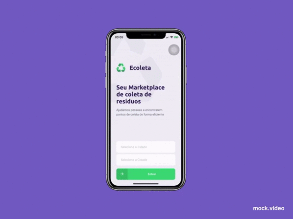

<h1 align="center">
    
</h1>

<p align="center">
    
  <a href="https://github.com/adlerke/ecoleta-nlw/commits/master">
    
  </a>
  
   <a href="https://github.com/adlerke/ecoleta-nlw/stargazers">
    
  </a>
<a href="https://www.linkedin.com/in/adler-kesley-34b09511b/" target="_blank" >
  
</a>

</p>


## ♻️ About Ecoleta

Ecoleta - is a way to connect companies and entities that collect organic and inorganic waste, to people who need to dispose of their waste in an ecological way.

<h6>Project built during <strong>NLW - Next Level Week</strong> offered by <a href="https://rocketseat.com.br/">[Rocketseat].</a></h6>

## 🎨 Layout

### Web
  Companies or entities can register on the web platform by sending the collection point info such as image, entity name, address, contact and select one or more items 

<p align="center" style="display: flex; align-items: flex-start; justify-content: center;">
  
</p>

### Mobile

Users will have access to the mobile application, where they can navigate the map to see the registered institutions according to the selected items and contact the entity via Email or WhatsApp

<p align="center">
  
</p>


## 🛠 Built with

This project was developed with the following technologies:

<details>
  <summary>Backend</summary>

-   [Node.js](https://nodejs.org/)
-   [Express](https://expressjs.com/)
-   [Typescript](https://www.typescriptlang.org/)
-   [TS-Node-Dev](https://www.npmjs.com/package/ts-node-dev)
-   [Celebrate](https://github.com/arb/celebrate)
-   [Cors](https://www.npmjs.com/package/cors)
-   [ESLint](https://eslint.org/)
-   [Prettier](https://prettier.io/)
-   [VS Code](https://code.visualstudio.com/)

</details>

<details>
  <summary>Frontend</summary>

-   [React](https://pt-br.reactjs.org/)
-   [Typescript](https://www.typescriptlang.org/)
-   [Axios](https://www.npmjs.com/package/axios)
-   [React Dropzone](https://github.com/react-dropzone/react-dropzone)
-   [React Icons](https://react-icons.netlify.com/#/)
-   [Leaflet](https://leafletjs.com/)
-   [React Leaflet](https://react-leaflet.js.org/)
-   [ESLint](https://eslint.org/)
-   [Prettier](https://prettier.io/)
-   [VS Code](https://code.visualstudio.com/)

</details>

<details>
  <summary>Mobile</summary>

-   [React](https://pt-br.reactjs.org/)
-   [React Native](https://reactnative.dev/)
-   [Expo](https://expo.io/learn)
-   [Typescript](https://www.typescriptlang.org/)
-   [React Navigation](https://reactnavigation.org/)
-   [Axios](https://www.npmjs.com/package/axios)
-   [Expo Google Fonts](https://github.com/expo/google-fonts)
-   [Expo Location](https://docs.expo.io/versions/latest/sdk/location/)
-   [Expo Mail Composer](https://docs.expo.io/versions/latest/sdk/mail-composer/)
-   [React Native Picker Select](https://www.npmjs.com/package/react-native-picker-select)
-   [ESLint](https://eslint.org/)
-   [Prettier](https://prettier.io/)
-   [VS Code](https://code.visualstudio.com/)

</details>


## 🚀 How to run Ecoleta Application

### 🎲 Running Backend

```bash
# Clone this repository
$ git clone https://github.com/adlerke/ecoleta-nlw

# Access the project folder
$ cd ecoleta-nlw

# Access the backend folder
$ cd backend

# install all dependencies
$ npm install

# run aplication
$ npm run dev

```

### 🧭 Running Frontend

```bash
# Clone this repository
$ git clone https://github.com/adlerke/ecoleta-nlw

# Access the project folder
$ cd ecoleta-nlw

# Access the frontend folder
$ cd frontend

# install all dependencies
$ npm install

# run aplication
$ npm start

```

### 📱Running Mobile Application

```bash
# Clone this repository
$ git clone https://github.com/adlerke/ecoleta-nlw

# Access the project folder
$ cd ecoleta-nlw

# Access the mobile folder
$ cd mobile

# install all dependencies
$ npm install

# run aplication
$ expo start

```

## 📝 License

Este projeto esta sobe a licença MIT.

by Adler Kesley [Get in touch](https://www.linkedin.com/in/adler-kesley-34b09511b)

[nodejs]: https://nodejs.org/
[typescript]: https://www.typescriptlang.org/
[expo]: https://expo.io/
[reactjs]: https://reactjs.org
[rn]: https://facebook.github.io/react-native/
[yarn]: https://yarnpkg.com/
[vscode]: https://code.visualstudio.com/
[vceditconfig]: https://marketplace.visualstudio.com/items?itemName=EditorConfig.EditorConfig
[license]: https://opensource.org/licenses/MIT
[vceslint]: https://marketplace.visualstudio.com/items?itemName=dbaeumer.vscode-eslint
[prettier]: https://marketplace.visualstudio.com/items?itemName=esbenp.prettier-vscode
[rs]: https://rocketseat.com.br
